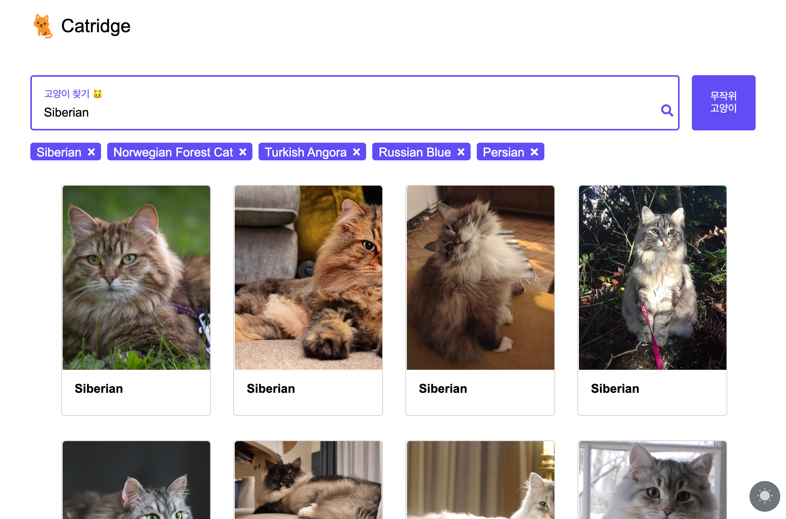

# catridge

프로그래머스 2020 Dev-Matching 고양이 사진 검색 사이트 과제를 내 맘대로 구현해 보자 🐱

## 개발 환경

- Javascript ES6+

## 문제

❗️ 표시는 필수 기능을 의미함

- HTML, CSS 관련
  - 시맨틱 태그 구조
  - 반응형
  - 다크 모드
- 이미지 상세 보기 모달 관련
  - 반응형
  - 닫기 기능 ❗️
  - 고양이 렌더링
- 검색 페이지 관련
  - Input에 Autofocus
  - Input클릭 시 입력된 키워드 삭제
  - 데이터 로딩 UI ❗️
  - 검색 결과 없는 경우 처리 ❗️
  - 최근 검색 키워드 5개까지만 노출
  - 최근 검색 키워드 클릭시 해당 키워드로 검색
  - 새로고침시 검색 결과 유지
  - 랜덤 고양이 버튼 ❗️
  - 이미지 Lazy load 처리
- 스크롤 페이징
- 랜덤 고양이 배너 섹션
  - 5개 노출
  - 좌, 우 슬라이드 버튼
- 모듈 형식으로 설계
- API의 응답 status code에 따른 에러 메시지 분리 ❗️
- 이벤트 위임 활용
- 컴포넌트 단위로 나누기
